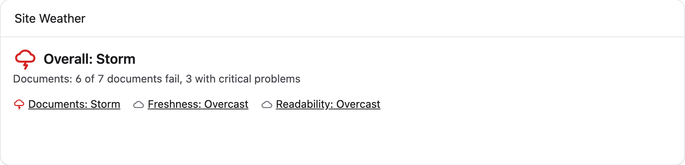
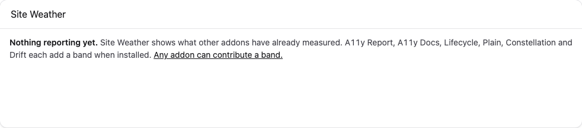

# Site Weather

**One dashboard tile that shows your site's health as weather.** Clear, fair,
overcast, rain, storm. Click a band, go to the addon that measured it.



**Site Weather never computes anything.** It has no scanner, no crawler and no
checks. It reads what other addons have already stored and renders it, which is
what keeps it free, tiny, and honest: if nothing is measuring a thing, the tile
does not pretend to know about it.

Free. Statamic 6, PHP 8.2.

## Installing

```
composer require bpmore/statamic-site-weather
```

Then put the widget on the dashboard in `config/statamic/cp.php`:

```php
'widgets' => [
    ['type' => 'site_weather', 'width' => 100],
],
```

There is nothing else to configure. No thresholds, no history, no
notifications: each addon that reports a band decides for itself what counts
as a storm, because it knows its own data better than a generic rule would.

## What you see

Each installed addon that reports supplies one **band**. The tile shows:

- the **overall** state, which is the *worst* band, not the average — one storm
  is a storm, and averaging would hide exactly what the tile exists to surface;
- the worst band's one-line **headline**, in plain words ("412 open issues");
- a strip of every band with its state, each linking to that addon's own
  dashboard.

Every state has a distinct icon shape *and* a word, never a colour alone. The
whole tile is one sentence for a screen reader before it is anything else:

> Overall: storm. Accessibility: storm, 412 open issues. Freshness: fair.
> Readability: unknown.

Nothing animates. A raining tile is charming once and irritating forever.

### Unknown is a real answer

An addon that is installed but has never run reports **unknown**, not clear.
The tile never implies health that nobody has measured. Unknown bands are
listed by name so the gap is visible, and they are never ranked against
measured ones — unknown is neither better nor worse than clear, it is absent.

### The empty state

With no contributors installed the tile says so:



It does not say "sunny". It says nothing is reporting yet, and names what
could.

## Bands

| Band | Reported by | Reads |
|---|---|---|
| Accessibility | A11y Report | open issues by impact |
| Documents | A11y Docs | failing documents, proportion of library |
| Freshness | Lifecycle | overdue percentage |
| Readability | Plain | proportion above target grade |
| Structure | Constellation | orphan count |
| Translations | Drift | localizations behind |

Missing addon, missing band — never a fake or zeroed one. Any addon can add a
band; see below.

## Writing a contributor

A contributor is one small class in the addon that owns the data. Site Weather
never imports it; it finds it through the container.

```php
use Bpmore\SiteWeather\Contracts\WeatherContributor;
use Bpmore\SiteWeather\Reading;
use Bpmore\SiteWeather\State;

class A11yWeatherContributor implements WeatherContributor
{
    public function __construct(private IssueRepository $issues) {}

    public function key(): string
    {
        return 'accessibility';
    }

    public function label(): string
    {
        return 'Accessibility';
    }

    public function reading(): Reading
    {
        $scan = $this->issues->latestScan();

        if ($scan === null) {
            return Reading::unknown('Run your first scan', cp_route('a11y-report.index'));
        }

        $state = match (true) {
            $scan->critical > 0 => State::Storm,
            $scan->serious > 0 => State::Rain,
            $scan->moderate > 0 => State::Overcast,
            $scan->minor > 0 => State::Fair,
            default => State::Clear,
        };

        return new Reading(
            state: $state,
            headline: "{$scan->open} open issues",
            url: cp_route('a11y-report.index'),
            computedAt: $scan->finishedAt,
        );
    }
}
```

Register it from your service provider by **tagging the class name**:

```php
$this->app->tag(A11yWeatherContributor::class, 'site-weather.contributors');
```

That is the whole integration, and it is deliberately just a string. Tagging a
class name never instantiates it, so if Site Weather is not installed nothing
resolves the tag, your class is never autoloaded, and the missing interface is
never noticed. Your addon needs no dependency on this one — list it under
`suggest` for your users and under `require-dev` so your own tests and static
analysis can see the interface.

### The rules

1. **`reading()` reads. It never computes.** Return what your addon has already
   stored — the last scan's result, a cached count. It runs on every dashboard
   load for every control-panel user, and Site Weather cannot enforce this: a
   contributor that scans on request makes the dashboard slow for everyone.
2. **Nothing measured yet? Return `Reading::unknown()`.** Never report clear for
   a site you have not looked at. Give the unknown reading a headline that says
   what to do ("Run your first scan") and a URL that goes there.
3. **A measured state needs a `computedAt`.** The `Reading` constructor refuses
   a clear/fair/overcast/rain/storm reading with no date, because a claim about
   the site with no moment attached is not one the tile will show.
4. **`key()` is a short, stable slug**, unique across addons. The first
   contributor registered for a key wins; a duplicate is logged and ignored.
5. **`url` is your addon's own dashboard** — the place a person lands when they
   click your band and want the detail.
6. **Thresholds are yours.** What makes accessibility a storm rather than rain
   is your call; Site Weather has no opinion and no configuration for it.

If `reading()` throws, the exception is logged and your band reads unknown with
the headline "Failed to report". The other bands render. The dashboard never
breaks because of a band.

### Trying it without a real contributor

For a dev site, a service provider that tags a few anonymous classes is enough
to see the tile populated. `Reading` and `State` are plain values; there is
nothing to mock.

## Accessibility of the tile itself

This would be an embarrassing place to fail, so the widget is audited with
axe against the real dashboard, populated and empty, in both colour schemes.
The record is in [`docs/audit/`](docs/audit/). Icons are decorative and always
sit beside text; every state's colour clears 3:1 on both the light and dark
card; keyboard focus on band links is visible; nothing moves.

## Requirements

- Statamic `^6.0`
- PHP `^8.2`

## Licence

MIT. See [LICENSE.md](LICENSE.md).
